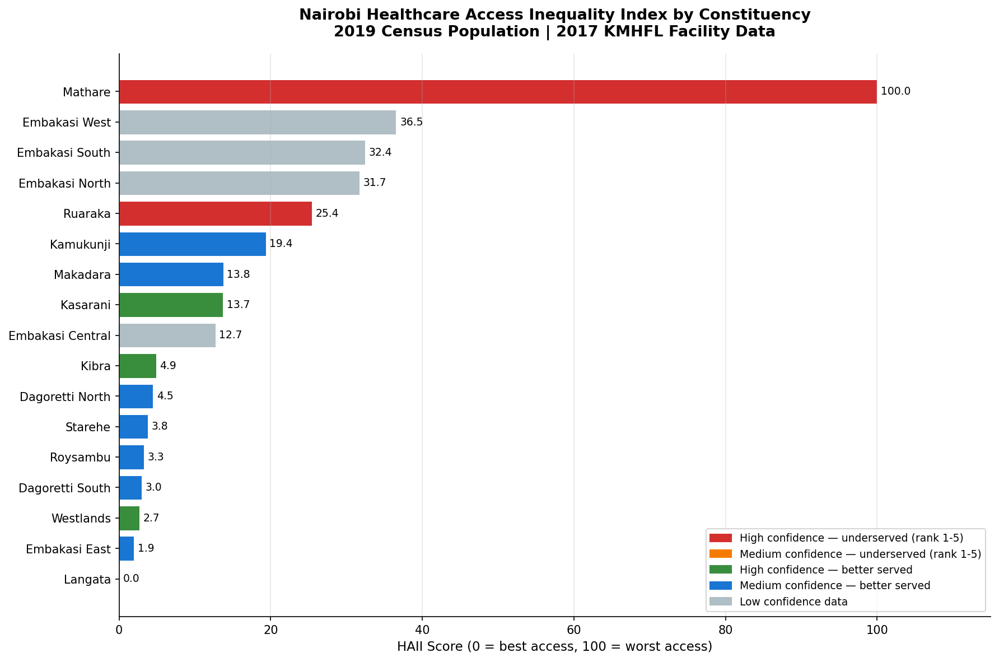
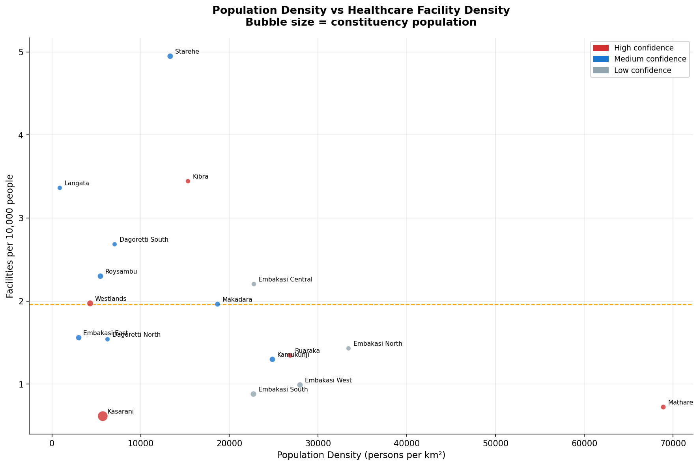

# Nairobi Healthcare Access Inequality Analysis

## Problem Statement

Nairobi’s healthcare access is unevenly distributed across constituencies when adjusted for population size and facility availability.

This project builds a **Healthcare Access Inequality Index (HAII)** using 2017 Kenya Master Health Facility List data and 2019 KNBS population estimates to measure spatial inequality and identify underserved areas for policy intervention.

---

## Key Insights

## 1. Severe healthcare inequality is concentrated in a few constituencies

Mathare is the most underserved constituency in Nairobi with **0.73 facilities per 10,000 people**, compared to the Nairobi average of **1.96**. It also has extreme population density (**68,855 persons/km²**), making access pressure significantly higher than other areas.

---

## 2. Healthcare infrastructure is structurally centralised

Approximately **75.7% of Level 4+ hospitals** are concentrated in only 5 constituencies, creating a spatial dependency where peripheral areas rely on central Nairobi for higher-level care.

---

## 3. Population size does not align with healthcare provision

Kasarani, with **780,656 residents**, has one of the lowest facility densities (**0.61 per 10,000**) and no Level 4+ hospital access, showing a mismatch between population pressure and healthcare provision.

---

## Policy Recommendations

## Priority 1 — High severity underserved areas

- Build **2 Level 3 health centres in Mathare**
- Develop a **shared Level 4 facility for Embakasi West, South, and North**

---

## Priority 2 — Hospital decentralisation policy

- Require at least **one Level 3 facility per constituency**
- Pause additional hospital concentration in already well-served constituencies until underserved areas are addressed

---

## Priority 3 — Data infrastructure improvement

- Request KNBS to publish clean constituency-level population datasets for Nairobi to improve planning accuracy and reduce reliance on reconstructed estimates

---

## Methodology

The Healthcare Access Inequality Index (HAII) was constructed using:

- Facility density per 10,000 people  
- Weighted facility levels (KEPH classification)  
- Population pressure adjustment  

All values were normalised to a 0–100 scale, where higher values indicate worse access.

---

## Limitations

- Facility data is from 2017 and may not reflect current availability  
- Population data for 12 constituencies is reconstructed rather than directly published  
- HAII does not account for facility quality, staffing levels, or utilisation rates  
- Private facility affordability is not captured  

---

## Visualisations

- [HAII Inequality Ranking](visuals/04_haii_ranking_chart.png)
- [Facility Distribution Map](visuals/03_facility_distribution.html)
- [Population Pressure vs Facility Density](visuals/05_density_scatter.png)
- [Interactive HAII Map](visuals/02_haii_choropleth_binned.html)
